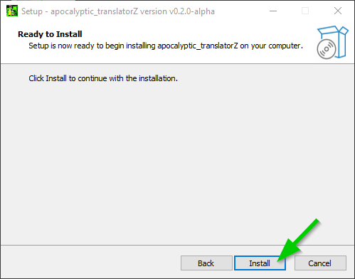
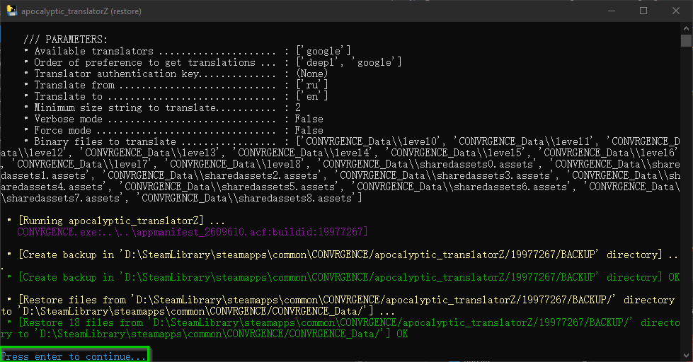

# apocalyptic_translatorZ

Mod for translating all Ukrainian or Russian texts of the following Steam games:
- '**CONVRGENCE**' by NikZ
- '**Paradox of Hope**' by NikZ
- '**Z.O.N.A Origin**' by AGaming+
- '**Z.O.N.A Project X**' by AGaming+

And enjoy Ukrainian or Russian voices while having all the texts in your native subtitle language!

This **apocalyptic_translatorZ** mod is an evolution of my deprecated [auto_ZONA_translator](https://github.com/peurKe/auto_ZONA_translator) mod

<!-- TOC -->
- [Discord](#Discord)
- [Steam community](#Steam-community)
- [Prerequisites](#Prerequisites)
- [Currently-supported-subtitle-languages](#Currently-supported-subtitle-languages)
- [Usage from executable installer](#Usage-from-executable-installer)
- [Release notes](#Release-notes)
<!-- /TOC -->

# Discord

- **CONVRGENCE**: [Additional subtitle languages to play with Russian voices](https://discord.com/channels/869881583635664946/1309965989462544395)
- **ZONA Origin**: [Welcome to #zona-translate-deepl!](https://discord.com/channels/1113935727202410691/1302585407308955690)

# Steam community

- **CONVRGENCE**: [Additional subtitle languages to play with Russian voices](https://steamcommunity.com/app/2609610/discussions/0/4629233379372516911)
- **ZONA Origin**: [Automatic translations for ZONA Origin and ProjectX](https://steamcommunity.com/app/2539520/discussions/0/4638238419731880745)

# Prerequisites

- Your **CONVRGENCE**, **Z.O.N.A Origin** or **Z.O.N.A Project X** games must be up to date

  (As **Paradox of Hope** game is no longer hosted by Steam, you need to make sure you have an updated version yourself.)

- Your PC must have an Internet connection for API requests to online translators

  (Only when new game updates containing new original text have not yet been translated by this mod and the translations of these new texts are not included in the mod installer).

# Currently-supported-subtitle-languages

  📌 **Chinese Simplified**, **Japanese Hiragana** and **Korean** subtitle languages are currently only available for **CONVRGENCE** game.

  📌 **Deepl** translations are currently only available for **Czech**, **Chinese Simplified**, **French**, **German**, **Japanese Hiragana** and **Korean** subtitle languages.

  📌 **Google** translations are currently available for all subtitle languages

| SUBTITLE LANGUAGES                  | DOWNLOAD                                                  | SUPPORTED GAMES                                     | DEEPL                            | GOOGLE                           |
|:------------------------------------|:---------------------------------------------------------:|:----------------------------------------------------|:--------------------------------:|:--------------------------------:|
| 中国語（簡体字）(Chinese Simplified) | [installer](https://tinyurl.com/apocalyptic-translator-Z) | CONVRGENCE                                          | **X**                            | **X**                            |
| Čeština (Czech)                     | [installer](https://tinyurl.com/apocalyptic-translator-Z) | CONVRGENCE Paradox_of_Hope ZONA ZONAORIGIN | **X**             **X** | **X** **X** **X** **X** |
| Dansk (Danish)                      | [installer](https://tinyurl.com/apocalyptic-translator-Z) | CONVRGENCE Paradox_of_Hope ZONA ZONAORIGIN |                         | **X** **X** **X** **X** |
| Deutsch (German)                    | [installer](https://tinyurl.com/apocalyptic-translator-Z) | CONVRGENCE Paradox_of_Hope ZONA ZONAORIGIN | **X**                | **X** **X** **X** **X** |
| English (English)                   | [installer](https://tinyurl.com/apocalyptic-translator-Z) | CONVRGENCE Paradox_of_Hope ZONA ZONAORIGIN |                         | **X** **X** **X** **X** |
| Español (Spanish)                   | [installer](https://tinyurl.com/apocalyptic-translator-Z) | CONVRGENCE Paradox_of_Hope ZONA ZONAORIGIN |                         | **X** **X** **X** **X** |
| Français (French)                   | [installer](https://tinyurl.com/apocalyptic-translator-Z) | CONVRGENCE Paradox_of_Hope ZONA ZONAORIGIN | **X**             **X** | **X** **X** **X** **X** |
| Italiano (Italian)                  | [installer](https://tinyurl.com/apocalyptic-translator-Z) | CONVRGENCE Paradox_of_Hope ZONA ZONAORIGIN |                         | **X** **X** **X** **X** |
| 日本語 ひらがな (Japanese Hiragana)  | [installer](https://tinyurl.com/apocalyptic-translator-Z) | CONVRGENCE                                          | **X**                            | **X**                            |
| 한국어 (Korean)                     | [installer](https://tinyurl.com/apocalyptic-translator-Z) | CONVRGENCE                                          | **X**                            | **X**                            |
| Magyar (Hungarian)                  | [installer](https://tinyurl.com/apocalyptic-translator-Z) | CONVRGENCE Paradox_of_Hope ZONA ZONAORIGIN |                         | **X** **X** **X** **X** |
| Nederlands (Dutch)                  | [installer](https://tinyurl.com/apocalyptic-translator-Z) | CONVRGENCE Paradox_of_Hope ZONA ZONAORIGIN |                         | **X** **X** **X** **X** |
| Polski (Polish)                     | [installer](https://tinyurl.com/apocalyptic-translator-Z) | CONVRGENCE Paradox_of_Hope ZONA ZONAORIGIN |                         | **X** **X** **X** **X** |
| Português (Portuguese)              | [installer](https://tinyurl.com/apocalyptic-translator-Z) | CONVRGENCE Paradox_of_Hope ZONA ZONAORIGIN |                         | **X** **X** **X** **X** |
| Română (Romanian)                   | [installer](https://tinyurl.com/apocalyptic-translator-Z) | CONVRGENCE Paradox_of_Hope ZONA ZONAORIGIN |                         | **X** **X** **X** **X** |
| Suomi (Finnish)                     | [installer](https://tinyurl.com/apocalyptic-translator-Z) | CONVRGENCE Paradox_of_Hope ZONA ZONAORIGIN |                         | **X** **X** **X** **X** |
| Svenska (Swedish)                   | [installer](https://tinyurl.com/apocalyptic-translator-Z) | CONVRGENCE Paradox_of_Hope ZONA ZONAORIGIN |                         | **X** **X** **X** **X** |

# Usage

## Download the EXE installer

Download the **installer** executable file from the link corresponding to your native subtitle language in the list above.

## Copy the downloaded executable file into game folder

- Copy it to your **CONVRGENCE** or **Paradox of Hope** or **Z.O.N.A Project X** or **Z.O.N.A Origin** game folder in your Steam library.
  By default in :
    - **CONVRGENCE** :arrow_right: C:\Program Files (x86)\Steam\steamapps\common\CONVRGENCE\
    - **Paradox of Hope** :arrow_right: C:\Program Files (x86)\Steam\steamapps\common\Paradox of Hope\ (You will first need to add the game as a non-Steam game)
    - **Z.O.N.A Project X** :arrow_right: C:\Program Files (x86)\Steam\steamapps\common\ZONA\
    - **Z.O.N.A Origin** :arrow_right: C:\Program Files (x86)\Steam\steamapps\common\ZONAORIGIN\

   NB: If your Z.O.N.A game is installed on a drive other than the system drive C:, then your game folder may be located on drive D: or E: or another drive:
    - **CONVRGENCE** :arrow_right: D:\Steam\Library\steamapps\common\CONVRGENCE\
    - **Paradox of Hope** :arrow_right: E:\Steam\Library\steamapps\common\Paradox of Hope\
    - **Z.O.N.A Project X** :arrow_right: F:\SteamLibrary\steamapps\common\ZONA\
    - **Z.O.N.A Origin** :arrow_right: G:\Steam\Library\steamapps\common\ZONAORIGIN\

   If you want to retrieve your exact game folder, you can go to your Steam library and:
    - Right-click on your game in your list of games in the left-hand panel.
    - Click on 'Properties...'
    - Click on 'Browse...'
   An explorer window will appear showing the folder for your game.
 
## Go to your game directory.

## Double-clic on EXE installer

- Click on 'Additional information' and 'Execute anyway':

  &nbsp;&nbsp;&nbsp;&nbsp;&nbsp;&nbsp;

- Tick the box corresponding to the subtitle language you wish to read in the game and clic on "Next" button:

  📌 If a subtitle language is disabled, it means that it is not yet supported for the current game.

  

- Tick the box corresponding to the translation service you want to use (DeepL or Google) and clic on "Next" button:

  📌 If the option is disabled, it means that it is not yet supported for the current game and subtitle language.

  

## The installer displays the main information about the installation process that will be carried out.

- Clic on 'Install' button.

  

## The installation python script then starts automatically

- Wait for the translation ending

  

## Approve the final message

- Read the message, clic on "OK" button, then clic on 'Finish" button:

  &nbsp;&nbsp;&nbsp;&nbsp;&nbsp;&nbsp;

## Enjoy Russian or Ukrainian or voices while having all the texts in your native subtitle language!

- Just launch your game from your Steam library as usual.
- Make sure you select the '**Russian**' or '**Ukrainian**' subtitle language in your your game settings.

## Restoring original subtitles procedure

- There are two methods available:
  - Either select '**English**' in your game settings,
  - Or run the shortcut '**apocalyptic_translatorZ (restore)**' created by the executable in your game directory, the restoration will start, and you will need to press "Enter" to close the window.

  &nbsp;&nbsp;&nbsp;&nbsp;&nbsp;&nbsp;

# Release notes

- v0.1.0-alpha
  - Initial update

- v0.1.1-alpha
  - Updated translators list in order of preference
  - Fixed Asian mod installer name
  - Added DeepL or Google translation service choice to the innosetup script

- v0.1.2-alpha
  - Updated ZH translation
  - Updated last ZH innosetup script

- v0.1.3-alpha
  - Improved ZH translations

- v0.1.4-alpha
  - Improved ZH translations

- v0.1.5-alpha
  - Improved ZH translations ('НАЗВАНИЕ' as not translated placeholders)

- v0.1.6-alpha
  - Added 'glossaries' and 'exclude_full_sentence' features
  - Added 'ru_fr_CONVRGENCE.json' translation DB file

- v0.1.7-alpha
  - Added '_____peurKe' in 'fix_list' in 'ru_fr_CONVRGENCE.json' translation DB file
  - updated 'ru_zh_CONVRGENCE.json' translation DB file with new text from Patch 0.4.4 holiday update
  - updated 'ru_fr_CONVRGENCE.json' translation DB file with new text from Patch 0.4.4 holiday update

- v0.1.8-alpha
  - Improve ZH and FR JSON translation DB files
  - Added 'LATIN_LETTERS_BYTES' as [a-zA-Z] in the middle of text to translate

- v0.1.9-alpha
  - The source language is now automatic
  - Added CS JSON translation DB files

- v0.2.0
  - ⚠️ Now, a single executable installer for all games and all subtitle languages
  - 🚀 Added detailed installation procedure with screenshots to the README.md file
  - 🚀 Added JSON translation database files in Japanese and Korean processed by DeepL and Google
  - 🚀 Added JSON translation database file in German processed by DeepL (request from @blankfx on Discord)
  - 🚀 Updated all JSON translation DB files
  - 🚀 Added a translation missing string (default '(!)') used when a translation is failed
  - 🚀 Added count for translation failed at the very end of script execution
  - 🚀 Added flush for JSON data into the JSON file after each subtitle language has been processed
  - 🚀 Added a JSON 'state' key in JSON database file with the current state ('IN PROGRESS' or 'DONE')
  - 🚀 Added a context value for ZONAORIGIN translation and DeepL translator
  - 🚀 Added a tool to check for unsupported Latin characters in JSON database files and ensure that translation IDs into JSON database file are compliant
  - 🚀 Added a tool to batch update custom translation corrections in JSON database files
  - 🐞 Fixed a bug when translated string is longer than the original string and additional characters are only spaces (the char indicating truncation '~' was incorrectly displayed at the end of the string)
  - 🐞 Fixed the replacement for specific extended latin characters with corresponding regular latin characters
  - 🐞 Fixed exception message to show the error details when DeepL fails
  - 🐞 Fixed a condition to use glossary only for DeepL translator (There is no glossary feature with Google translator)
  - 🐞 Fixed some German translation errors in JSON database file
